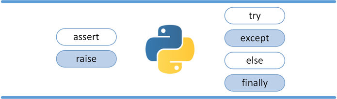
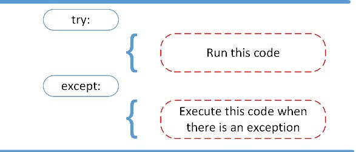
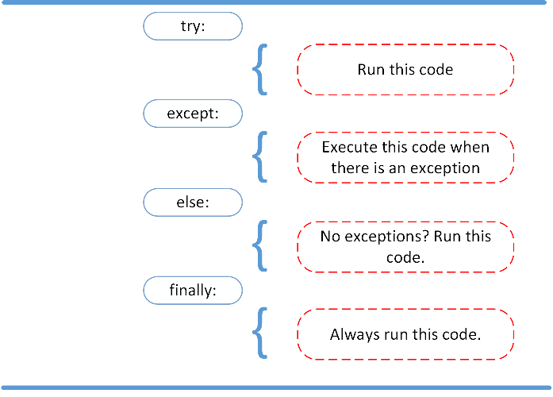

# Exception Handling

- Exception (hata), yazılım dillerinde belli olaylarda programı durdurup hata döndürmeye yarar.
- Exception oluştuğu zaman, hata yakalanmamışsa (handling) programın tamamı durur.
- Built-in exception'lar olduğu gibi, kullanıcı tarafından da programın belli yerlerinde belli durumlarda programın ilerleyişini durdurmak için özel hatalar oluşturulabilir.
  - Tüm built-in exception'lar için bkz: https://docs.python.org/3/library/exceptions.html
  - Tüm exception'lar `Exception` sınıfından türetilmiştir.
- `SyntaxError` yakalanamayan özel bir hatadır. Handle kodları içinde dahi olsa, syntax hataları programı tamamen durdurur.

<p align="center"></p>

## Create Exception

- `raise` keyword'ü kullanılarak `Exception()` sınıfından üretilen bir obje hata olarak oluşturulup fırlatılabilir.

```python
# main.py
number = input("Give number between 0-10 : ")
if int(number) > 10:
    raise Exception("Number cannot be more than 10!")
print("Your number is:", number)

	# Success running
>>> %Run main.py
Give number between 0-10 : 5
Your number is: 5
    
    # Built-in Error
>>> %Run main.py
Give number between 0-10 : foo
Traceback (most recent call last):
  File "C:\Users\Serhat\Desktop\python-test\main.py", line 3, in <module>
    if int(number) > 10:
ValueError: invalid literal for int() with base 10: 'foo'

        # Custom Error
>>> %Run main.py
Give number between 0-10 : 20
Traceback (most recent call last):
  File "C:\Users\Serhat\Desktop\python-test\main.py", line 4, in <module>
    raise Exception("Number cannot be more than 10!")
Exception: Number cannot be more than 10!
```

- `assert` keywordü kullanılarak da hata fırlatma yapılabilir. Bu keyword genellikle unit testlerde kullanılır. Eğer belirtilen durum sağlanmazsa, belirtilen hata `AssertionError` olarak döner.

```python
>>> import sys

>>> assert "linux" in sys.platform, "This code runs on linux only!"
Traceback (most recent call last):
  File "<stdin>", line 1, in <module>
AssertionError: This code runs on linux only!
This code runs on linux only!
>>> assert "win" in sys.platform, "This code runs on linux only!"
>>>
```

## Handling Exceptions - The `try` and `except` Block

- `try` ve `except`, hataları handle etmek için iki blok oluşturur. 
  - `try`: Blok içine normal çalışmasını istediğimiz kodları yazarız. Except yazılmadan sadece try kullanılamaz.
  - `except`: Try içindeki kodlar herhangi bir hata vermeden çalışırsa, bu blok çalışmaz. Eğer try içinde herhangi bir hata alınırsa, program o satırdan sonrasını okumaz, except bloğuna geçer. Except bloğu içinde hata alma durumunda neler yapılacağı yazılır.

<p align="center"></p>

```python
>>> try:
...     a = 0 / 1
...     print("Test meessage")
... except:
...     # create log etc.
...     print("Exception catched!")
Test meessage

>>> try:
...     a = 0 / 0
...     print("Test meessage")
... except:
...     # create log etc.
...     print("Exception catched!")
Exception catched!

>>> try:
...     a = 0 / 0
...     print("Test meessage")
... except Exception as exp:
...     # create log etc.
...     print("Exception catched!")
...     print(exp)
Exception catched!
division by zero
```

- Except keyword'ü ile bir hata class'ı tanımlanırsa, except bloğu sadece o hatada çalışır. Eğer farklı bir hata gelirse ve hatayı yakalayacak herhangi bir except bloğu yoksa, hata dışarıya verilir.
- Birden fazla except blogu verilebilir. Except blokları, `if/elif/else` blokları gibi sırayla çalışır, herhangi bir except bloğu hatayı yakalarsa diğer except bloklarına bakılmaz.
- Spesifik hatalar yakalandıktan sonra kalan tüm hataları yakalamak için en sona `except:` veya `except Exception:` bloğu eklenebilir. `Exception` sınıfı tüm diğer hata sınıflarının ana sınıfı olduğundan, tüm hatalar `Exception` ile yakalanabilir. 

```python
>>> try:
...     a = 0 / 0
...     print(x)
... except ZeroDivisionError as e:
...     print("ERROR : ", e)

ERROR :  division by zero

>>> try:
...     a = 0 / 1
...     print(x)
... except ZeroDivisionError as e:
...     print("ERROR : ", e)

Traceback (most recent call last):
  File "<stdin>", line 3, in <module>
NameError: name 'x' is not defined
name 'x' is not defined

>>> try:
...     a = 0 / 1
...     print(x)
... except ZeroDivisionError as e:
...     print("ERROR : ", e)
... except NameError as e:
...     print("ERROR : ", e)

ERROR :  name 'x' is not defined

>>> try:
...     a = 0 / 1
...     open("test.json")
... except ZeroDivisionError as e:
...     print("ERROR : ", e)
... except NameError as e:
...     print("ERROR : ", e)
... except Exception as e:
...     print("ERROR : ", e)

ERROR :  [Errno 2] No such file or directory: 'test.json'
```

## The `else` and `finally` Blocks

- `else` blogu, `try/except` bloklarıyla beraber kullanıldığında, try blogunda herhangi bir hata oluşmazsa çalışacak kodları barındırır. Başka bir deyişle `except` bloğuyla ters çalışır; `except` çalışırsa `else` çalışmaz; `except` çalışmazsa, `else` çalışır.
- `finally` bloğu en sonra yazılır ve her durumda çalışması istenilen kodlar yazılır. Özellikle dosyaların kapatılması, database bağlantısının kapatılması vs. gibi durumlarda kullanılır.

<p align="center"></p>

```python
>>> try:
...     assert False, "Exception!"
...     print("try")
... except:
...     print("except")
... else:
...     print("else")
... finally:
...     print("finally")
except
finally

>>> try:
...     assert True, "Exception!"
...     print("try")
... except:
...     print("except")
... else:
...     print("else")
... finally:
...     print("finally")
try
else
finally
```

## Özet olarak;

- `raise` allows you to throw an exception at any time.
- `assert` enables you to verify if a certain condition is met and throw an exception if it isn’t.
- In the `try` clause, all statements are executed until an exception is encountered.
- `except` is used to catch and handle the exception(s) that are encountered in the try clause.
- `else` lets you code sections that should run only when no exceptions are encountered in the try clause.
- `finally` enables you to execute sections of code that should always run, with or without any previously encountered exceptions.
