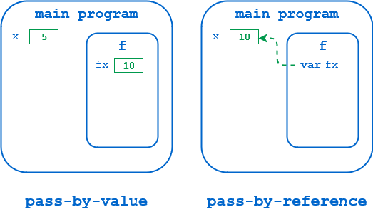
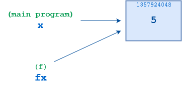
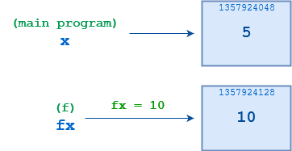

# Python Pass-By-Assignment

- Programlama dillerinde fonksiyonlara argüman gönderilirken iki temel paradigmaya uyulur (başka mekanizmalar da mevcuttur ama temelde bu iki yöntem takip edilir.):
    - Pass-by-value : Gönderilen değişkenin kopyası oluşturulup fonksiyon içi işlemler yapılır. 
    - Pass-by-reference : Değişkenin referansı üzerinden işlemler yapılır.

**C# EXAMPLE**

```c#
// PASS-BY-VALUE EXAMPLE
using System;				
public class Program
{
	public static void f(int fx){
		Console.WriteLine("Start f()  :" + fx.ToString());
		fx = 10;
		Console.WriteLine("End f()    :" + fx.ToString());
	}
	
	public static void Main()
	{
		int x = 5;
		Console.WriteLine("Before f() :" + x.ToString());
		f(x);
		Console.WriteLine("After f()  :" + x.ToString());
	}
}

// Before f() :5
// Start f()  :5
// End f()    :10
// After f()  :5
```

```c#
// PASS-BY-REFERENCE EXAMPLE
using System;				
public class Program
{
	public static void f(ref int fx){ // adding "ref" here!
		Console.WriteLine("Start f()  :" + fx.ToString());
		fx = 10;
		Console.WriteLine("End f()    :" + fx.ToString());
	}
	
	public static void Main()
	{
		int x = 5;
		Console.WriteLine("Before f() :" + x.ToString());
		f(ref x); // adding "ref" here!
		Console.WriteLine("After f()  :" + x.ToString());
	}
}

// Before f() :5
// Start f()  :5
// End f()    :10
// After f()  :10
```

**PASCAL EXAMPLE**

```pascal
// PASS-BY-VALUE EXAMPLE
procedure f(fx : integer);
begin
    writeln('Start  f():  fx = ', fx);
    fx := 10;
    writeln('End    f():  fx = ', fx);
end;

var
    x : integer;

begin
    x := 5;
    writeln('Before f():  x = ', x);
    f(x);
    writeln('After  f():  x = ', x);
end.

// Before f():  x = 5
// Start  f():  fx = 5
// End    f():  fx = 10
// After  f():  x = 5
```

```pascal
// PASS-BY-REFERENCE EXAMPLE
procedure f(var fx : integer); // adding "var" here!
begin
    writeln('Start  f():  fx = ', fx);
    fx := 10;
    writeln('End    f():  fx = ', fx);
end;

var
    x : integer;

begin
    x := 5;
    writeln('Before f():  x = ', x);
    f(x);
    writeln('After  f():  x = ', x);
end.

// Before f():  x = 5
// Start  f():  fx = 5
// End    f():  fx = 10
// After  f():  x = 10
```

- İlk örneklerde fonksiyona argüman olarak verilen değişkenlerin değerleri kopyalanıp üzerinden işlemler yapılır. Bunun sonucunda argüman olarak verilen değişkenin kendi değeri değişmez. 
- İkinci örneklerde ise fonksiyona argüman olarak verilen değişkenlerin referansları üzerinden işlem yapılır. Argüman olarak verilen değişkenin referans değerinin value'si değiştiğinden, son durumda değişkenin değeri de değişmiş olur.

<p align="center"></p>

## Python Pass-By-Assignment

- Python yazılım dilinde her şey birer objedir. Diğer dillerde değişkenler referens olarak belirli bir bellek konumunu işaret ederken, python dilinde değişkenler referans olarak bir objeyi işaret ederler. **Python'da bir değişkene yeni bir değer atandığında, diğer dillerdeki gibi referans belleğin içindeki değer değişmez, yeni bir obje oluşturulup değişkenin referansı yeni değere atanır.** (Ayrıntılar için "Memory Management" notuna bakılabilir.)

- Pythonda fonksiyonlara argüman atandığında, argümanla fonksiyon parametresi aynı objeye referans verir. Eğer fonksiyon içinde parametreye yeni bir değer atanırsa, python değişken ataması kuralları gereği, yeni değer bir obje olarak oluşturulup parametre bu objeye işaret eder (Rebounding). Sonuç olarak argüman olarak atanan değişkenin referansı eski objede kaldığından değeri değişmez. 

```python
>>> def f(fx):
...     fx = 10
...
>>> x = 5
>>> f(x)
>>> x
5
```

- Yukarıdaki örnek üzerinden gidersek,
    - Öncelikle `<class 'int'>` tipinde bir obje oluşturulup `5` değeri atanır. 
    - `x` değişkeni bu objeye referans verir.
    - Fonksiyon çalıştırıldığında `fx` ve `x` değişkenlerine aynı referans atanır, aynı objeyi işaret ederler.
    - `fx` değişkenine yeni bir atama yapıldığında, `<class 'int'>` tipinde ve `10` değerinde yeni bir obje oluşturulur ve `fx` bu objeye referans vermeye başlar.

<p align="center"></p>

<p align="center"></p>

```python
>>> def f(fx):
...     print('fx =', fx, '/ id(fx) = ', id(fx))
...     fx = 10
...     print('fx =', fx, '/ id(fx) = ', id(fx))
...

>>> x = 5
>>> print('x =', x, '/ id(x) = ', id(x))
x = 5 / id(x) =  1357924048

>>> f(x)
fx = 5 / id(fx) =  1357924048
fx = 10 / id(fx) =  1357924128

>>> print('x =', x, '/ id(x) = ', id(x))
x = 5 / id(x) =  1357924048
```

- Python'da fonksiyonlara değer ataması `pass-by-value` ve `pass-by-referance` metotlarının hibriti gibidir. Bu yüzden `pass-by-assigment` olarak adlandırılır.
- Sonuç olarak Python'da argüman olarak verilen değişkenlerin içeriği, fonksiyon içinde yeniden atama yapılırsa değişmez.

```python
vars = (
    40,
    dict(foo=1, bar=2),
    {1, 2, 3},
    'bar',
    ['foo', 'bar', 'baz']
)

def f(x):
    x = "foo"
    
for i in vars:
    f(i)
    print(i)
    
# 40
# {'foo': 1, 'bar': 2}
# {1, 2, 3}
# bar
# ['foo', 'bar', 'baz']
```

- **IMPORTANT**: Mutable değerlere sahip argümanlar fonksiyona verilirse ve yeni atama yapılmayıp sadece içeriği değişirse, argüman olarak gönderilen değişkenin de içeriği değişir. Bunun nedeni, fonksiyona argüman verildiğinde, parametrenin de aynı objeye referans vermesidir (bkz: yukarıdaki örnekler). Mutable değerlerde içerik değişiklerinde yeni bir obje oluşturulmadığı unutulmamalıdır, bundan dolayı parametre için yeni obje oluşturulmaz (rebounding olmaz). Fakat parametrenin içeriği değiştirilmez ve yeni bir atama yapılırsa, yeni bir obje oluşur.

```python
l = [1,2,3]

def f1(x):
    x = ["foo", "bar"]

def f2(x):
    x.append(4)
    x[0] = 0
    
print(l)
f1(l)
print(l)
f2(l)
print(l)

# [1, 2, 3]
# [1, 2, 3]
# [0, 2, 3, 4]
```

