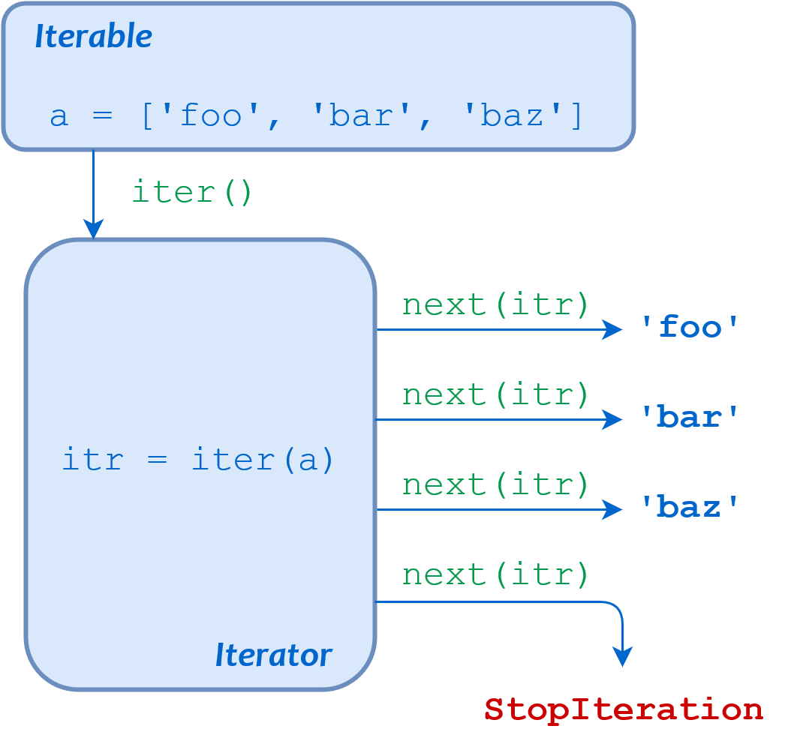

# Python Iteration

- Python'da temel olarak iki iteration kavramı vardır:

1. **"iterable" kavramı** : İçinde birden fazla elaman bulunduran ve döngü içinde yinelenebilir objelerdir.
    -  Örn : string, list, tuple, dict, set, and frozenset
2. **"iterator" kavramı** : Pythondaki bir veri yapısıdır. İçindeki elemanları teker teker döndürür.
    - Build-in `iter()` fonksiyonuyla oluşturulabilir.
    - Özellikle dosya okuma gibi büyük boyutlu input alan fonksiyonlar built-in olarak `iterator` tipindedir. Okunan input (dosya vs.) içinde eleman eleman (örn. dosyasının her bir satırı) okuma yapılır. Bu sayade tüm dosya okunup RAM'e yüklenmez, sadece veri çekildikçe (iter obje döndükçe) okuma yapılır ve sadece bu kısım RAM'e yazılır, kullanıldıktan sonra RAM'den silinir.

- `Lazy Iterator` : Liste ve türevlerinin aksine içeriğini RAM'de tutmayan yapılardır.
    - https://en.wikipedia.org/wiki/Lazy_evaluation

| Term          | Meaning                                                      |
| ------------- | ------------------------------------------------------------ |
| **Iteration** | The process of looping through the objects or items in a collection |
| **Iterable**  | An object (or the adjective used to describe an object) that can be iterated over |
| **Iterator**  | The object that produces successive items or values from its associated iterable |
| **`iter()`**  | The built-in function used to obtain an iterator from an iterable |

```python
>>> iter('foobar')                             # String
<str_iterator object at 0x036E2750>

>>> iter(['foo', 'bar', 'baz'])                # List
<list_iterator object at 0x036E27D0>

>>> iter(('foo', 'bar', 'baz'))                # Tuple
<tuple_iterator object at 0x036E27F0>

>>> iter({'foo', 'bar', 'baz'})                # Set
<set_iterator object at 0x036DEA08>

>>> iter({'foo': 1, 'bar': 2, 'baz': 3})       # Dict
<dict_keyiterator object at 0x036DD990>
```

- Iterator elemanları `next()` fonksiyonuyla teker teker çekilerek kullanılabilir.
    - Iterator objesinde eleman kalmadığında `StopIteration` hatası verir.
    - Iterator elamenları sadece sırasıyla çekilebilir. Çekildikten sonra silinirler ve geriye giden "prev()" gibi bir fonksiyon yoktur. 

```python
>>> a = ['foo', 'bar', 'baz']

>>> itr = iter(a)
>>> itr
<list_iterator object at 0x031EFD10>

>>> next(itr)
'foo'
>>> next(itr)
'bar'
>>> next(itr)
'baz'
>>> next(itr)
Traceback (most recent call last):
  File "<stdin>", line 1, in <module>
StopIteration
```

- Her iterator objesi kendi konum durumunu (internal state) tutar.

```python
>>> a
['foo', 'bar', 'baz']

>>> itr1 = iter(a)
>>> itr2 = iter(a)

>>> next(itr1)
'foo'
>>> next(itr1)
'bar'
>>> next(itr1)
'baz'

>>> next(itr2)
'foo'
```

- Iterator objesi tür dönüşümüne uğrarsa tüm elemanlarını yeni türe dönüştürür.
    - Oluşacak objenin içeriği çok büyükse `MemoryError` hatası alınabilir.

```python
>>> a = ['foo', 'bar', 'baz']
>>> itr = iter(a)
>>> list(itr)
['foo', 'bar', 'baz']
```

## For Loop Behavior In-Deph

```python
>>> a = ['foo', 'bar', 'baz']
>>> for i in a:
...     print(i)
...
foo
bar
baz
```

- Python, yukarıdaki örnek for döngüsünü işlerken şu adımları uygular:
    1. `iter()` fonksiyonunu çağırıp `a` nesnesini "iterable" hale getirir.
    2. Her döngüde `next()` fonksiyonunu kullanarak `a` objesinden bir nesne elde edilir ve `i` değişkenine atanır.
    3. `next()` fonksiyonu `StopIteration` hatası verdiğinde döngüyü sonlandırır.

<p align="center"></p>

## Generators

- Normal fonksiyonlar gibi yazılır, farklı olarak dönecek değerleri `return` ile değil `yield` ile dönerler.

```python
# Normal function. Warning : This function never return list because of infinite loop
>>> def infinite_sequence():
...     list = []
...     num = 0
...     while True:
...         list.append(num)
...         num += 1
...     return list

>>> type(infinite_sequence)
<class 'function'>

# Generator
>>> def infinite_sequence():
...     num = 0
...     while True:
...         yield num
...         num += 1
        
>>> type(infinite_sequence())
<class 'generator'>
```

- Fonksiyon çalıştırıldığında, `yield` ile değer döndürdükten sonra fonksiyondan çıkış yapılmaz ve çalışmaya devam etmez. Fonksiyon `yield` adımında durur ve mevcut durum hafızaya kaydedilir.
- `next()` metoduyla fonksiyondan sonraki değer istendiğinde, fonksiyon hafızaya kaydettiği durumda (`yield` adımından) çalışmaya devam eder ve sonrasında ilk gördüğü `yield` adımında değer döndürüp tekrar mevcut durumu kaydeder.
- Bu şekilde fonksiyon, `yield` adımıyla döndürülecek veri kalmayana kadar çalışmaya devam eder.
    - Generator içinde veri kalmadığında `next()` ile veri çekilmeye çalışılırsa, `StopIteration` hatası verir.

```python
>>> gen = infinite_sequence()
>>> gen
<generator object infinite_sequence at 0x0000017C7D8BC890>
>>> next(gen)
0
>>> next(gen)
1
>>> next(gen)
2
>>> next(gen)
3
```

```python
>>> def infinite_sequence():
...     for num in range(2):
...         yield num
...         num += 1

# Using generator with next()
>>> gen = infinite_sequence()
>>> next(gen)
0
>>> next(gen)
1
>>> next(gen)
Traceback (most recent call last):
  File "<stdin>", line 1, in <module>
StopIteration

# Using generator in for loop
>>> gen = infinite_sequence()
>>> for item in gen:
...     print(item)
0
1
```

- Generator içinde birden fazla `yield` kullanılabilir. Generator, her `yield` adımında durur ve sonucu döndürür.

```python
>>> def multi_yield():
...     yield_str = "This will print the first string"
...     yield yield_str
...     yield_str = "This will print the second string"
...     yield yield_str

>>> multi_obj = multi_yield()

>>> print(next(multi_obj))
This will print the first string

>>> print(next(multi_obj))
This will print the second string

>>> print(next(multi_obj))
Traceback (most recent call last):
  File "<stdin>", line 1, in <module>
StopIteration
```

## Generator Expression (Generator Comprehesion)

- Tek satırda generator oluşturma işlemidir.

```python
# Create generator with function
>>> def csv_reader(file_name):
...     for row in open(file_name, "r"):
...         yield row
        
# Generator Expression
>>> csv_gen = (row for row in open(file_name))

# Generator Expression
>>> a = (k for k in range(9999))
>>> a
<generator object <genexpr> at 0x00000150C74C5120>
```

```python
>>> nums_squared_lc = [num**2 for num in range(5)]
>>> nums_squared_gc = (num**2 for num in range(5))

>>> nums_squared_lc
[0, 1, 4, 9, 16]
>>> nums_squared_gc
<generator object <genexpr> at 0x107fbbc78>
```

## Generator Performance

- Generator'lar; içerikleri değil, sadece durumları hafızada tuttuklarından, RAM üzerinde çok daha az yer kaplarlar.

```python
>>> import sys

>>> nums_squared_lc = [i * 2 for i in range(10000)]
>>> sys.getsizeof(nums_squared_lc)
87624

>>> nums_squared_gc = (i ** 2 for i in range(10000))
>>> print(sys.getsizeof(nums_squared_gc))
120
```

- Bununla birlikte, listeler içerikleri direk olarak RAM'den çektiklerinden daha hızlı işlem yaparlar. Generator'lar, her değeri oluştururken yeniden çalıştırılır.

```python
>>> cProfile.run('sum([i * 2 for i in range(1000000)])')
         5 function calls in 0.084 seconds

   Ordered by: standard name

   ncalls  tottime  percall  cumtime  percall filename:lineno(function)
        1    0.058    0.058    0.058    0.058 <string>:1(<listcomp>)
        1    0.007    0.007    0.084    0.084 <string>:1(<module>)
        1    0.000    0.000    0.084    0.084 {built-in method builtins.exec}
        1    0.019    0.019    0.019    0.019 {built-in method builtins.sum}
        1    0.000    0.000    0.000    0.000 {method 'disable' of '_lsprof.Profiler' objects}


>>> cProfile.run('sum((i * 2 for i in range(1000000)))')
         1000005 function calls in 0.192 seconds

   Ordered by: standard name

   ncalls  tottime  percall  cumtime  percall filename:lineno(function)
  1000001    0.094    0.000    0.094    0.000 <string>:1(<genexpr>)
        1    0.000    0.000    0.192    0.192 <string>:1(<module>)
        1    0.000    0.000    0.192    0.192 {built-in method builtins.exec}
        1    0.098    0.098    0.192    0.192 {built-in method builtins.sum}
        1    0.000    0.000    0.000    0.000 {method 'disable' of '_lsprof.Profiler' objects}
```

## Advanced Generator Methods

```python
def even_numbers():
    num = 0
    while num < 30:
        if num % 2 == 0:
            r = yield num
            if r is not None:
                num = r
        num += 1
```

### `.send()` metodu

- Generator metottan `yield` ile değer alabildiğimiz gibi, yine `yield` ile  generator metoda değer alabiliriz.
- Değer göndermek için `.send()` metodu kullanılır.
    - Eğer generator sonlanmışsa, değer göndermeye çalıştığımızda `StopIteration` hatası alınır.
    - Eğer generator halen başlamamışsa `TypeError` hatası alınır.
- `yield` adımında dönen değer eğer, eğer `.send()` fonksiyonu kullanılmamışsa `None` döner.
    - `next()` ile değer çağrıldığında `yield` `None` döner.
    - Generator for içinde döndürülürse yine `None` döner.
    - Bu durumlardan dolayı, `yield` ile alınacak değerin `None` kontrolünün yapılması gerekir.
- **IMPORTANT** : `.send()` metodu kullanıldığında generator bir kere çalışır ve sonuç döner. Sonraki çalışmalar bu çalışmadan dönen sonucun üzerinden devam eder.

```python
gen = even_numbers()

for number in gen:
    print(number)
    if number == 10:
        test = gen.send(20)
        print("test is:", test)
        
# RESULT
0
2
4
6
8
10
test is: 22
24
26
28
```

### `.throw()` metodu

- Generator içinden exception fırlatmaya yarar.
- Oluşacak exception generator içinde oluşur ve istenilirse generator içinde handle edilebilir.
- Generator içinde oluşan hatalar, generator'ı sonlandırır.

```python
gen = even_numbers()

for number in gen:
    print(number)
    if number == 10:
        gen.throw(ValueError("This is a error!"))
        
# RESULT
0
2
4
6
8
10
Traceback (most recent call last):
  File "C:\Users\serhat\Desktop\test2.py", line 21, in <module>
    gen.throw(ValueError("This is a error!"))
  File "C:\Users\serhat\Desktop\test2.py", line 5, in even_numbers
    r = yield num
ValueError: This is a error!
```

### `.close()` metodu

- Verilen generator'ı sonlandırır.

```python
gen = even_numbers()

for number in gen:
    print(number)
    if number == 10:
        gen.close()
        gen.send(20)

# RESULT
0
2
4
6
8
10
Traceback (most recent call last):
  File "C:\Users\serhat\Desktop\test2.py", line 27, in <module>
    gen.send(20)
StopIteration
```

## Generator Pipeline

- Birden çok generator metodunun birbirini çağırmasıyla oluşturulan yapıdır.
- Her generator metot, başka bir generator metodu çağırır. Bu şekilde data üzerinde yapılacaklar işlemler generatorlar fonksiyonlarında tanımlanır ama data çağırılmayana kadar hafıza üzerinde herhangi bir işlem yapılmaz. 
- Özellikle büyük datalarla uğraşırken, RAM kullanımını önemli ölçüde azaltır.

```python
def infinite_numbers():
    num = 0
    while True:
        yield num
        num += 1
        
def even_numbers():
    inf = infinite_numbers()
    for i in inf:
        if i % 999999 == 0:
            yield i
            
def start_with_5():
    even = even_numbers()
    for i in even:
        if str(i)[0] == "5":
            yield i
            
for i in start_with_5():
    print(i)
```

- CSV okuma örneği ([Örnek Dosya](../statics/files/grades.csv))
    1. Her satırı oku
    2. Her satırdaki elemanları virgül üzerinden ayır
    3. Başlıkları ayır
    4. Her bir kişi için başlıkları ve değerleri birleştirerek bir dictionary oluştur
    5. Test ortalaması 60 üzerinde olanları yazdır

```python
file_name 	= "grades.csv"
clean 		= lambda list : [l.strip().replace('"',"") for l in list]
calculate 	= lambda *tests : sum(tests) / len(tests) > 60

# Get each row > 1st iterator
rows 		= (row for row in open(file_name))

# Split by comma, convert to value list from each row > 2nd iterator
items 		= (item.strip().split(",") for item in rows) # 2nd iter

# Get first line as header
headers 	= clean(next(items))

# Match headers and values for each line > 3rd/4rd iterator
# zip() function is also iterator here 
user_dicts 	= (dict(zip(headers, clean(data))) for data in items)

# Find only success people > 5rd iterator
success 	= (k for k in user_dicts
           if calculate(float(k["Test1"]), float(k["Test2"]), float(k["Test4"]), float(k["Test4"])))

for i in success:
    print(i)
```

