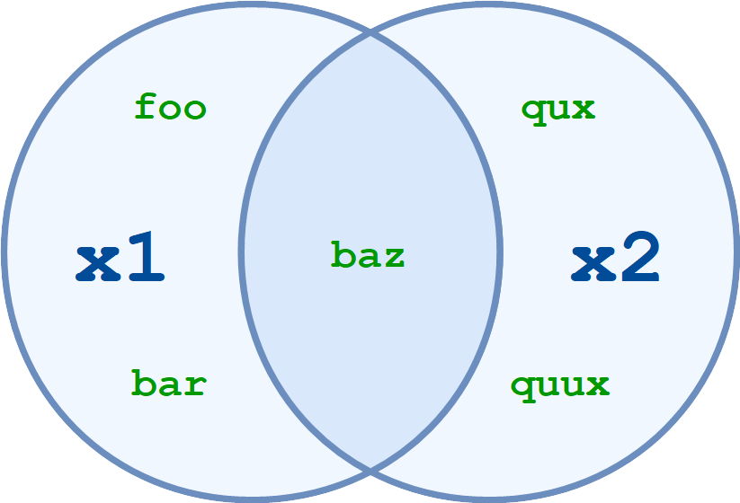
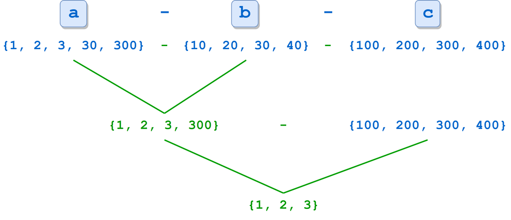

# Koleksiyon Veri Tipleri - Sets (Kümeler)

- Kümelerin özellikleri:
    - Kümelerdeki elemanlar sırasızdır.
    - Küme içindeki elemanlar benzersizdir, aynı elemandan birden fazla bulunamaz.
    - Kümenin kendisi mutable yapıdadır, fakat elemanlarının immutable olması gerekir.

## Küme Tanımlama

- 1. tanımlama yolu aşağıdaki gibidir. Fonksiyon içine iterable objeler alır.

```python
x = set(<iter>)
```

```python
>>> x = set(['foo', 'bar', 'baz', 'foo', 'qux'])
>>> x
{'qux', 'foo', 'bar', 'baz'}

>>> x = set(('foo', 'bar', 'baz', 'foo', 'qux'))
>>> x
{'qux', 'foo', 'bar', 'baz'}

>>> s = 'quux'

>>> list(s)
['q', 'u', 'u', 'x']
>>> set(s)
{'x', 'u', 'q'}
```

- 2. tanımlama yolu süslü parantezler içinde objelerin belirilmesi yöntemidir. Buradaki objelerin hepsinin immutable olması şarttır.

```python
x = {<obj>, <obj>, ..., <obj>}
```

- Kümeler, immutable olmak şartıyla tüm değişken tiplerinden eleman bulundurabilirler.

```python
>>> x = {'foo', 'bar', 'baz', 'foo', 'qux', 1, 2, 3, 2}
>>> x
{1, 2, 3, 'baz', 'qux', 'bar', 'foo'}

>>> x = {42, 'foo', (1, 2, 3), 3.14159}
>>> x
{42, 'foo', 3.14159, (1, 2, 3)}
```

- İki tanımlama arasındaki fark aşağıdaki gibidir. Eğer iter objeler kümelere çevrilecekse 1. yöntem, eğer objelerden bir küme yapılacaksa 2. yöntem kullanılmalıdır.

```python
>>> {'foo'}
{'foo'}

>>> set('foo')
{'o', 'f'}
```

- Eğer boş bir küme belirtilecekse, `set()` kullanılmalıdır. `{}` kullanılırsa boş bir sözlük oluşturulur.

```python
>>> type({})
<class 'dict'>

>>> type(set())
<class 'set'>
```

## Set Operatörleri

- `in` : Set içinde belli bir kelimenin olup olmadığına bakma
- `not in` : in yapısının tersi

```python
>>> x = {'foo', 'bar', 'baz'}

>>> 'bar' in x
True
>>> 'qux' in x
False
```

## Set Fonksiyonları

- `len()` : Set eleman sayısını verir
- `max()` : Set en büyük key elemanını verir. String değerler varsa unicode değerlerinin toplamına göre işlem yapar. Eleman tiplerinin aynı olması gerekir.
- `min()` : Set en küçük key elemanını verir. String değerler varsa unicode değerlerinin toplamına göre işlem yapar. Eleman tiplerinin aynı olması gerekir.

```python
>>> x = {1,3,2,0,-1}

>>> len(x)
5
>>> max(x)
3
>>> min(x)
-1
```

## Set Operatör ve Metotları

- Operatörler kullanılırsa, her değişkenin set objesi olması zorunludur.
- Metotlar kullanılırken böyle bir zorunluluk yoktur. Metot içine alınan obje, eğer küme tipinde değilse öncleikle kümeye çevrilir, daha sonra işlem yapılır.

```python
>>> x1 = {'foo', 'bar', 'baz'}

>>> x1 | ('baz', 'qux', 'quux')
Traceback (most recent call last):
  File "<pyshell#43>", line 1, in <module>
    x1 | ('baz', 'qux', 'quux')
TypeError: unsupported operand type(s) for |: 'set' and 'tuple'

>>> x1.union(('baz', 'qux', 'quux'))
{'baz', 'quux', 'qux', 'bar', 'foo'}
```

- `x1.union(x2[, x3 ...])` veya `x1 | x2 [| x3 ...]`
    - Kümelerin birleşimini alır.

<p align="center"></p>

```python
>>> x1 = {'foo', 'bar', 'baz'}
>>> x2 = {'baz', 'qux', 'quux'}

>>> x1.union(x2)
{'foo', 'qux', 'quux', 'baz', 'bar'}

>>> x1 | x2
{'foo', 'qux', 'quux', 'baz', 'bar'}
```

- `x1.intersection(x2[, x3 ...])` veya `x1 & x2 [& x3 ...]`
    - Kümelerin keşisimini alır.

<p align="center"></p>

```python
>>> x1 = {'foo', 'bar', 'baz'}
>>> x2 = {'baz', 'qux', 'quux'}

>>> x1.intersection(x2)
{'baz'}

>>> x1 & x2
{'baz'}
```

- `x1.difference(x2[, x3 ...])` veya `x1 - x2 [- x3 ...]`
    - Kümelerin farkını alır.

<p align="center"></p>

```python
>>> x1 = {'foo', 'bar', 'baz'}
>>> x2 = {'baz', 'qux', 'quux'}

>>> x1.difference(x2)
{'foo', 'bar'}

>>> x1 - x2
{'foo', 'bar'}
```

Eğer birden fazla sayıda kümede fark işlemi yapılırsa, soldan sağa doğru bir ilerleme gözlenecektir.

```python
>>> a = {1, 2, 3, 30, 300}
>>> b = {10, 20, 30, 40}
>>> c = {100, 200, 300, 400}

>>> a.difference(b, c)
{1, 2, 3}

>>> a - b - c
{1, 2, 3}
```

<p align="center"></p>

- `x1.symmetric_difference(x2)` veya `x1 ^ x2 [^ x3 ...]`
    - Kümelerin simetrik farkını alır.

<p align="center"></p>

```python
>>> x1 = {'foo', 'bar', 'baz'}
>>> x2 = {'baz', 'qux', 'quux'}

>>> x1.symmetric_difference(x2)
{'foo', 'qux', 'quux', 'bar'}

>>> x1 ^ x2
{'foo', 'qux', 'quux', 'bar'}
```

Eğer birden fazla kümede simetrik fark işlemi yapılacaksa, `^` operatörü kullanılmalıdır. Metot kullanıldığında hata verecektir.

```python
>>> a = {1, 2, 3, 4, 5}
>>> b = {10, 2, 3, 4, 50}
>>> c = {1, 50, 100}

>>> a ^ b ^ c
{100, 5, 10}

>>> a.symmetric_difference(b, c)
Traceback (most recent call last):
  File "<pyshell#11>", line 1, in <module>
    a.symmetric_difference(b, c)
TypeError: symmetric_difference() takes exactly one argument (2 given)
```

- `x1.isdisjoint(x2)`
    - Eğer iki küme ayrık kümelerse (ortak elemanları yoksa) `True` döner, aksi halde `False` döner.
    - Sadece iki küme arasında işlem yapılabilir.

```python
>>> x1 = {'foo', 'bar', 'baz'}
>>> x2 = {'baz', 'qux', 'quux'}

>>> x1.isdisjoint(x2)
False

>>> x1 = {1, 3, 5}
>>> x2 = {2, 4, 6}

>>> x1.isdisjoint(x2)
True
```

- `x1.issubset(x2)` veya `x1 <= x2`
    - Bir kümenin başka bir kümenin alt kümesi olup olmadığını bulmaya yarar.
    - Eğer bir kümenin tüm elemanları diğer kümede bulunuyorsa `True`, bulunmuyorsa `False` döner.
    - Ayrıca her küme kendisinin de alt kümesi olduğundan, kendi ile işleme sokulursa `True` dönecektir.

```python
>>> x1 = {'foo', 'bar', 'baz'}
>>> x1.issubset({'foo', 'bar', 'baz', 'qux', 'quux'})
True

>>> x2 = {'baz', 'qux', 'quux'}
>>> x1 <= x2
False

>>> x.issubset(x)
True
```

- `x1 < x2`
    - `s.issubset()` fonksiyonuna benzerdir, fakat kendisi ile işleme sokulursa `False` döner.

```python
>>> x1 = {'foo', 'bar'}
>>> x2 = {'foo', 'bar', 'baz'}
>>> x1 < x2
True

>>> x1 = {'foo', 'bar', 'baz'}
>>> x2 = {'foo', 'bar', 'baz'}
>>> x1 < x2
False

>>> x = {1, 2, 3, 4, 5}
>>> x <= x
True
>>> x < x
False
```

- `x1.issuperset(x2)` veya `x1 >= x2`
    - Bir küme, diğer bir kümeyi kapsıyorsa `True`, kapsamıyorsa `False` döner.
    - Her küme kendisini kapsadığı için `True` dönecektir.

```python
>>> x1 = {'foo', 'bar', 'baz'}

>>> x1.issuperset({'foo', 'bar'})
True

>>> x2 = {'baz', 'qux', 'quux'}
>>> x1 >= x2
False

>>> x = {1, 2, 3, 4, 5}
>>> x.issuperset(x)
True
```

- `x1 > x2`
    - `s.issuperset()` fonksiyonuna benzerdir ama kendi ile işleme sokulursa `False` döner.

```python
>>> x1 = {'foo', 'bar', 'baz'}
>>> x2 = {'foo', 'bar'}
>>> x1 > x2
True

>>> x = {1, 2, 3, 4, 5}
>>> x > x
False
```

## Kümeler Üzerinde Değişiklik Yapma

- `x1.update(x2[, x3 ...])` veya `x1 |= x2 [| x3 ...]`
    - Farklılıkları bulup kümeye bunları ekler.

```python
>>> x1 = {'foo', 'bar', 'baz'}
>>> x2 = {'foo', 'baz', 'qux'}

>>> x1 |= x2
>>> x1
{'qux', 'foo', 'bar', 'baz'}

>>> x1.update(['corge', 'garply'])
>>> x1
{'qux', 'corge', 'garply', 'foo', 'bar', 'baz'}
```

- `x1.intersection_update(x2[, x3 ...])` veya `x1 &= x2 [& x3 ...]`
    - İki kümede aynı olan elemanları bularak, önceki kümeye bunları atar.

```python
>>> x1 = {'foo', 'bar', 'baz'}
>>> x2 = {'foo', 'baz', 'qux'}

>>> x1 &= x2
>>> x1
{'foo', 'baz'}

>>> x1.intersection_update(['baz', 'qux'])
>>> x1
{'baz'}
```

- `x1.difference_update(x2[, x3 ...])` veya `x1 -= x2 [| x3 ...]`
    - Kümeler arasında fark işlemi yaparak önceki kümeye sonucu atar.

```python
>>> x1 = {'foo', 'bar', 'baz'}
>>> x2 = {'foo', 'baz', 'qux'}

>>> x1 -= x2
>>> x1
{'bar'}

>>> x1.difference_update(['foo', 'bar', 'qux'])
>>> x1
set()
```

- `x1.symmetric_difference_update(x2)` veya `x1 ^= x2`
    - Kümeler arasında simetrik fark işlemi yaparak önceki kümeye bunları atar.

```python
>>> x1 = {'foo', 'bar', 'baz'}
>>> x2 = {'foo', 'baz', 'qux'}
>>> 
>>> x1 ^= x2
>>> x1
{'bar', 'qux'}
>>> 
>>> x1.symmetric_difference_update(['qux', 'corge'])
>>> x1
{'bar', 'corge'}
```

## Kümeler Üzerinde Ekleme, Çıkarma ve Diğer İşlemler

- `x.add(<elem>)`
    - Kümeye eleman ekler.

```python
>>> x = {'foo', 'bar', 'baz'}

>>> x.add('qux')
>>> x
{'bar', 'baz', 'foo', 'qux'}
```

- `x.remove(<elem>)`
    - Verilen elemanı kümeden kaldırır.
    - Eğer verilen eleman kümede yoksa `KeyError` hatası döner.

```python
>>> x = {'foo', 'bar', 'baz'}

>>> x.remove('baz')
>>> x
{'bar', 'foo'}

>>> x.remove('qux')
Traceback (most recent call last):
  File "<pyshell#58>", line 1, in <module>
    x.remove('qux')
KeyError: 'qux'
```

- `x.discard(<elem>)`
    - Verilen elemanı kümeden kaldırır.
    - Eğer verilen eleman kümede yoksa hata dönmez.

```python
>>> x = {'foo', 'bar', 'baz'}

>>> x.discard('baz')
>>> x
{'bar', 'foo'}

>>> x.discard('qux')
>>> x
{'bar', 'foo'}
```

- `x.pop()`
    - Küme içinden rastgele bir elemanı çıkarır.
    - Eğer küme içinde herhangi bir eleman yoksa `KeyError` hatası döner.

```python
>>> x = {'foo', 'bar', 'baz'}

>>> x.pop()
'bar'
>>> x
{'baz', 'foo'}

>>> x.pop()
'baz'
>>> x
{'foo'}

>>> x.pop()
'foo'
>>> x
set()

>>> x.pop()
Traceback (most recent call last):
  File "<pyshell#82>", line 1, in <module>
    x.pop()
KeyError: 'pop from an empty set'
```

- `x.clear()`
    - Küme içindeki tüm elemanları kaldırır.

```python
>>> x = {'foo', 'bar', 'baz'}
>>> x
{'foo', 'bar', 'baz'}
>>> 
>>> x.clear()
>>> x
set()
```

## Frozen Sets

- `Frozen Set` python içinde built-in bulunan diğer bir veri tipidir.
- Kümelere benzer, tek farkı immutable olmasıdır.
- Yazılım içinde, değiştirilmesi istenmeyen değişken verileri için kullanılır. 
- Küme metotlarından değişiklik yapan metotlar dışındaki tüm metotlar kullanılabilir, fakat değişiklik yapan metotlar kullanılmak istendiği zaman hata verir.

```python
>>> x = frozenset(['foo', 'bar', 'baz'])
>>> x
frozenset({'foo', 'baz', 'bar'})

>>> len(x)
3

>>> x & {'baz', 'qux', 'quux'}
frozenset({'baz'})
```

```python
>>> x = frozenset(['foo', 'bar', 'baz'])

>>> x.add('qux')
Traceback (most recent call last):
  File "<pyshell#127>", line 1, in <module>
    x.add('qux')
AttributeError: 'frozenset' object has no attribute 'add'

>>> x.pop()
Traceback (most recent call last):
  File "<pyshell#129>", line 1, in <module>
    x.pop()
AttributeError: 'frozenset' object has no attribute 'pop'

>>> x.clear()
Traceback (most recent call last):
  File "<pyshell#131>", line 1, in <module>
    x.clear()
AttributeError: 'frozenset' object has no attribute 'clear'

>>> x
frozenset({'foo', 'bar', 'baz'})
```

- `Değişiklik yap ve ata` operatörleri, frozen set yapıları için kullanılabilir.
    - Burada aslında bir değişiklik yapılmamaktadır, yeni bir atama yapılmaktadır. Bundan dolayı immutable durumuna ters değildir.
    - Örnek olarak `x &= s` olarak yazılan kod aslında `x = x & s` anlamı taşımaktadır ve yeni bir atama yapmaktadır.

```python
>>> f = frozenset(['foo', 'bar', 'baz'])
>>> s = {'baz', 'qux', 'quux'}

>>> f &= s
>>> f
frozenset({'baz'})
```

```python
>>> f = frozenset(['foo', 'bar', 'baz'])
>>> id(f)
56992872
>>> s = {'baz', 'qux', 'quux'}

>>> f &= s
>>> f
frozenset({'baz'})
>>> id(f)
56992152
```

- Frozenset yapıları, özellikle immutable eleman isteyen yapılarda (kümeler, sözlüklerin key değerleri) küme özellikleri kullanılmak istendiğinde yararlıdır.

```python
>>> x1 = set(['foo'])
>>> x2 = set(['bar'])
>>> x3 = set(['baz'])
>>> x = {x1, x2, x3}
Traceback (most recent call last):
  File "<pyshell#38>", line 1, in <module>
    x = {x1, x2, x3}
TypeError: unhashable type: 'set'

>>> x1 = frozenset(['foo'])
>>> x2 = frozenset(['bar'])
>>> x3 = frozenset(['baz'])
>>> x = {x1, x2, x3}
>>> x
{frozenset({'bar'}), frozenset({'baz'}), frozenset({'foo'})}
```

```python
>>> x = {1, 2, 3}
>>> y = {'a', 'b', 'c'}
>>> 
>>> d = {x: 'foo', y: 'bar'}
Traceback (most recent call last):
  File "<pyshell#3>", line 1, in <module>
    d = {x: 'foo', y: 'bar'}
TypeError: unhashable type: 'set'

>>> x = frozenset({1, 2, 3})
>>> y = frozenset({'a', 'b', 'c'})
>>> 
>>> d = {x: 'foo', y: 'bar'}
>>> d
{frozenset({1, 2, 3}): 'foo', frozenset({'c', 'a', 'b'}): 'bar'}
```